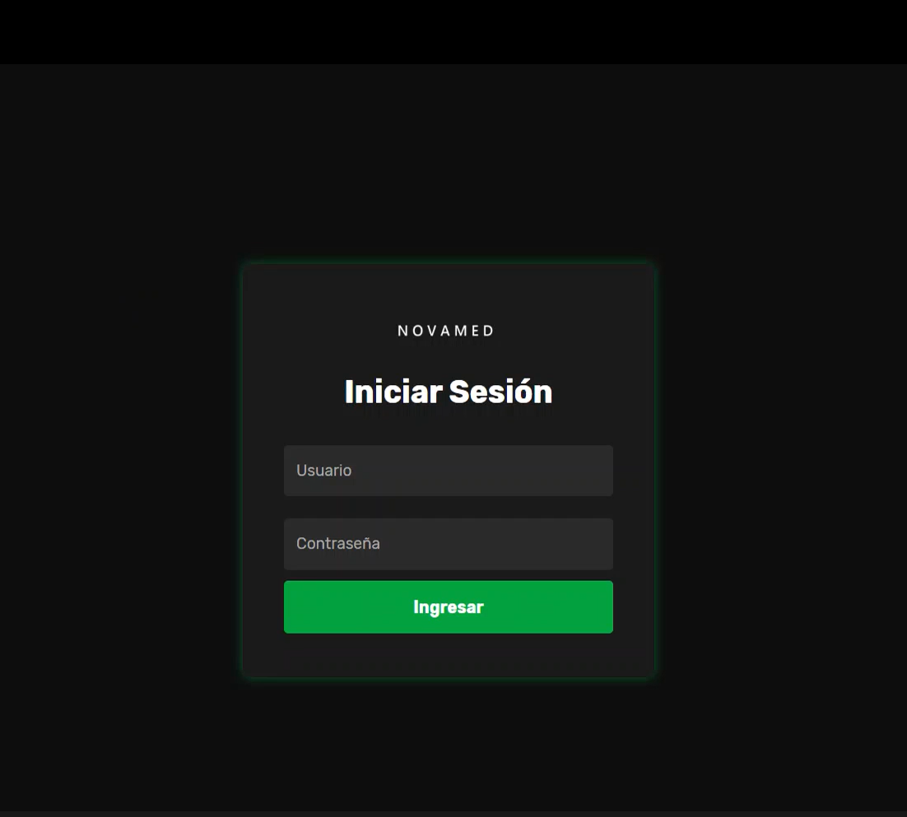
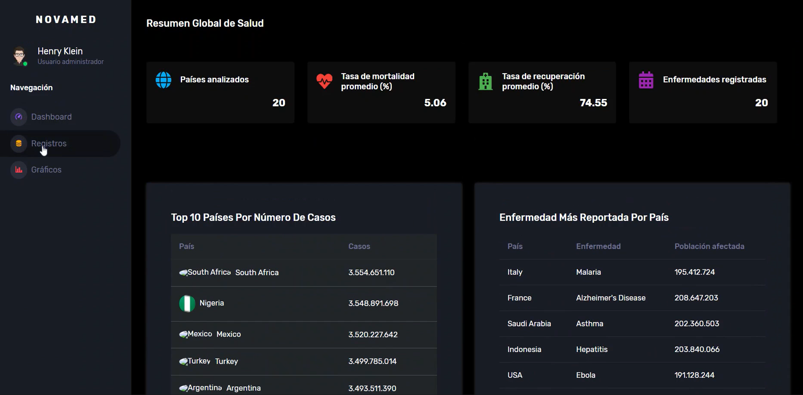
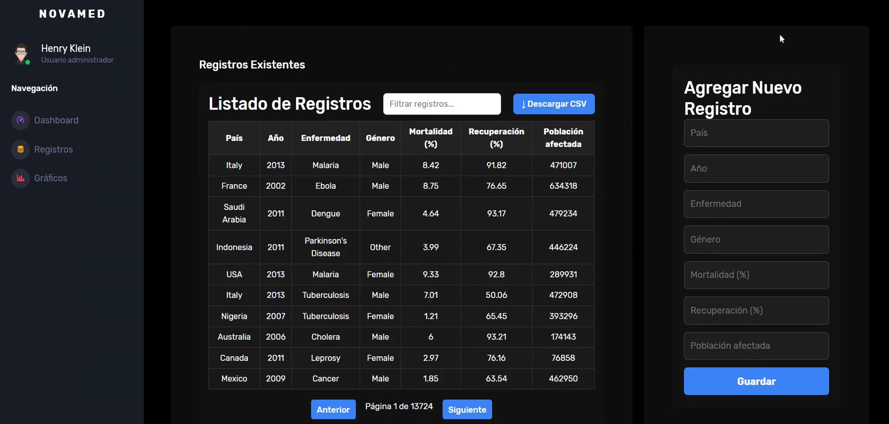
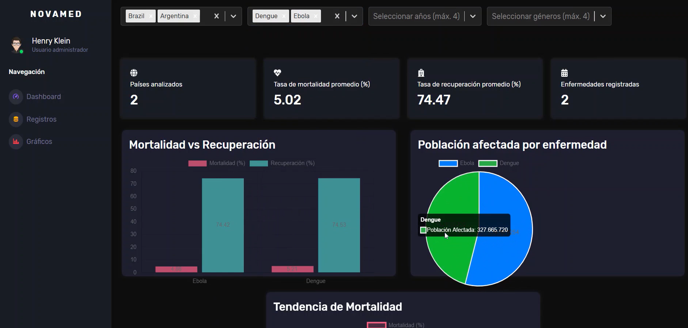

# Health Dashboard V2 - Frontend

Este es el frontend del proyecto **Health Dashboard**, desarrollado con **React + Vite**. Permite visualizar estadísticas de salud, operaciones y clientes, mediante gráficos, tablas, filtros interactivos y carga de archivos Excel.

---

## 🚀 Tecnologías utilizadas

- [React 18](https://react.dev/)
- [Vite](https://vitejs.dev/)
- [Mantine UI](https://mantine.dev/)
- [React Router DOM](https://reactrouter.com/)
- [Axios](https://axios-http.com/)
- [Chart.js + react-chartjs-2](https://www.chartjs.org/)
- [xlsx](https://sheetjs.com/) (para manejo de archivos Excel)

---

# 📦 Instalación y uso

## Instalar dependencias
npm install

## Iniciar en modo desarrollo
npm run dev

Este frontend se conecta con el backend ubicado en:
https://github.com/TatianaPinzonR/dashboard-backend 

# 🎥 Vista previa

### 🔐 Login

### 📊 Dashboard

### 📋 Registros

### 📈 Estadísticas

